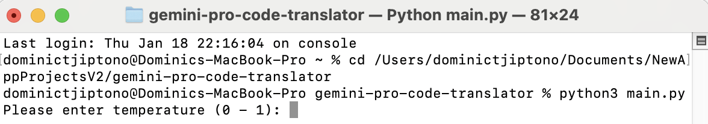

# gemini-pro-code-translator

Ever wondered about translating code from one programming language to another quickly? **Gemini Pro Code Translator**
is the tool to do so.

# Source Code

The source code of the application **Gemini Pro Code Translator** is available in [Source Code](https://github.com/GlobalCreativeApkDev/gemini-pro-code-translator/blob/master/main.py).

# Installation

```
pip install gemini-pro-code-translator
```

# How to Use the Application?

Pre-requisites:

1. [Python](https://www.python.org/downloads/) installed in your device.
2. .env file in the same directory as <GEMINI_PRO_CODE_TRANSLATOR_DIRECTORY> and has the value of GEMINI_API_KEY.

First, open a Terminal or Command Prompt window and run the following command.

```
cd <GEMINI_PRO_CODE_TRANSLATOR_DIRECTORY>
python3 main.py
```

**Note:** Replace <GEMINI_PRO_CODE_TRANSLATOR_DIRECTORY> with the path to the directory of the application
**Gemini Pro Code Translator**.

Then, the application will start with something looking like in the screenshot below.



You will then be asked to input the following values.

1. Temperature - between 0 and 1 inclusive
2. Top P - between 0 and 1 inclusive
3. Top K - at least 1
4. Max output tokens - at least 1

The following screenshot shows what is displayed after inputting the mentioned values.


You will be required to input the following pieces of information.

1. The name of the programming language you want to translate code from.
2. The path of the file containing the code to be translated.
3. The name of the programming language you want to translate code to (must be different from the one in step 1).
4. The name of the file you want the translated code to be placed in (without the extension).

Once you enter the values mentioned above, the file containing the code will be created inside "codes" directory. 
Then, you will be asked whether you still want to continue unit testing or not. If you enter 'Y', you will be 
redirected to an application window like in screenshot above. Else, you will exit the application.


Below demonstrates how the file containing the translated code looks like.


